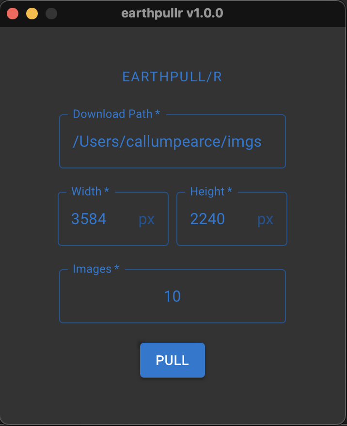

# earthpullr

earthpullr is a small desktop application which fetches images from https://www.reddit.com/r/EarthPorn/
which fit your desktop background perfectly! 

## How it works
Just fill in the full directory path to where you want to download the images to, the width and height of your screen 
will be automatically detected, then state how many images you wish to download and hit pull! earthpullr will
then crawl through reddit/r/EarthPorn to find images which match the specification and download them to this directory.

## Download
The latest version of earthpullr can be downloaded below

| Operating System | Download |
|------------------|----------|
| MacOS/amd64            |   [v1.0.0]()       |
| Windows/amd64          |   [v1.0.0]()       |

## Contribute
earthpullr is open for any contributions. If you want to contribute but are not sure what to add it's worth taking
a look at the [TODO list](doc/TODO.md) which is where future feature ideas are currently stored.

### Setting up your development environment
- earthpullr uses the [Wails](https://wails.app) to create a desktop application written in Go and React JS. Follow the 
instruction on the [Wails getting started page](https://wails.app/gettingstarted/) to get setup with developing a Wails 
desktop application.
- To cross compile earthpullr you will also need [Docker](https://docs.docker.com/get-docker/) installed on your machine.

## License
[MIT LICENSE](LICENSE.txt)